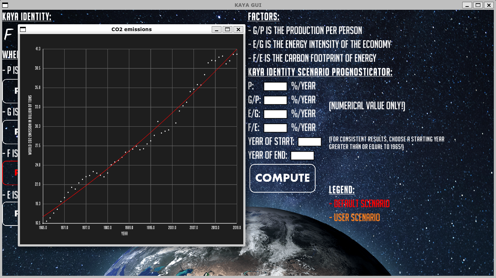

# KayaGUI : Une interface graphique pour l'équation de KAYA

Ce projet est une application graphique écrite en C++ de l'équation de [KAYA](https://fr.wikipedia.org/wiki/%C3%89quation_de_Kaya).



## Installation

Pour l'affichage, l'application nécessite l'installation de la librarie graphique SFML.
Concernant l'installation sur Linux (Debian based distro uniquement pour la commande) :

```bash
sudo apt-get install libsfml-dev
```

Pour d'autres distros Linux, voir votre package managers.
Il existe aussi une version pour Windows et MAC (voir la [documentation](https://www.sfml-dev.org/tutorials/2.5/#getting-started)).

**ATTENTION** : Version 2.5 minimum et C++17 sont requis.  

## Lancement

Pour créer l'exécutable, il suffit d'utiliser la commande `make` et l'exécutable `kayaGUI.out` sera
généré. Pour lancer l'application, il faut lancer l'exécutable :

```bash
./kayaGUI.out
```

Par ailleurs, si lors du lancement il y a des erreurs/warnings OpenGL alors il faudra soit installer des drivers graphiques appropriés ou bien réduire/supprimer le niveau antialiasing dans les fichiers WindowPlot.cpp et WindowMain.cpp (CTRL + F avec "antialiasingLevel = 8"). 

## Fonctionnement

L'équation de KAYA permet de relier les émissions de CO2 à certains paramètres économico-sociaux : la population, la richesse et la technologie. En d'autres termes, cela permet de voir comment
l'évolution de ces paramètres affectent l'évolution des émissions de CO2. Pour pouvoir donc l'utiliser, l'application se base sur une régression linéaire effectuée sur chacun de ces paramètres :

- les émissions mondiales de CO2
- la population mondiale
- le PIB mondial
- la consommation d'énergie mondiale

Cette régression est effectué par un script R se basant sur les données disponibles dans le dossier
data (pour les [sources](https://github.com/T-amairi/KayaGUI/blob/main/data/sources.txt)).

Dans l'application, les boutons plots permettent donc d'afficher les données et les régressions linéaires. Concernant la partie **kaya identity scenario prognosticator**, elle permet d'obtenir un modèle simple pour prévoir les futures émissions de CO2, basé sur les options fourni par l'utilisateur dans les cases **%/YEAR** : une valeur positive signifie une évolution croissante et à l'inverse une valeur négative une évolution décroissante. Ce modèle sera calculé sur la période [YEAR OF START ; YEAR OF END] et pour des résultats cohérents, il est recommandé de commencer avec une année supérieure ou égale à 1965. Finalement, le bouton compute permet d'afficher deux courbes :

- la courbe orange correspond à l'évolution du CO2 selon le scénario de l'utilisateur.
- la courbe rouge correspond à l'évolution du CO2 selon un scénario sans aucun changement.

## Auteurs

- Hamza RAIS
- Tahar AMAIRI
